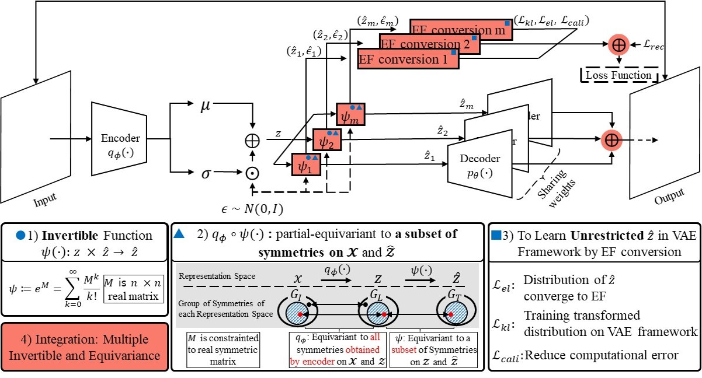

# Latent Vector Transformation for Disentanglement with Multiple Invertible and Partially Equivaraint Function in VAEs

Submmitted Article (IEEE) "This work has been submitted to the IEEE for possible publication. Copyright may be transferred without notice, after which this version may no longer be accessible" (2023. 05)



## Abstract
Disentanglement learning is a core issue for understanding and re-using trained information in Variational AutoEncoder (VAE), and effective inductive bias has been reported as a key factor.
However, the actual implementation of such bias is still vague.
In this paper, we propose a novel method, called *Multiple Invertible and partial-equivariant transformation* (MIPE-transformation), to inject inductive bias by 1) guaranteeing the invertibility of latent-to-latent vector transformation while preserving a certain portion of equivariance of input-to-latent vector transformation, called *Invertible and partial-equivariant transformation* (IPE-transformation), 2) extending the form of prior and posterior in VAE frameworks to an unrestricted form through a learnable conversion to an approximated exponential family, called *Exponential Family conversion* (EF-conversion), and 3) integrating multiple units of IPE-transformation and EF-conversion, and their training. 
In experiments on 3D Cars, 3D Shapes, and dSprites datasets, MIPE-transformation improves the disentanglement performance of state-of-the-art VAEs.

## Requirements

### Environment
**CUDNN 10**

    conda create -n env_name python=3.7.10 pytorch=1.8.1 torchvision tqdm tensorboard
    conda create -n env_name pytorch torchvision torchaudio tqdm tensorboard pytest h5py scipy scikit-learn cudatoolkit=10.2 -c pytorch 
    
**CUDNN 11**
    
    conda create -n env_name python=3.7.10 pytorch=1.9.0 torchvision tqdm tensorboard
    conda create -n env_name pytorch torchvision torchaudio tqdm tensorboard pytest h5py scipy scikit-learn cudatoolkit=11.1 -c pytorch -c nvidia 
    

 ## Datasets
 **dSprites**:
 Download dsprites_ndarray_co1sh3sc6or40x32y32_64x64.npz from [here](https://github.com/deepmind/dsprites-dataset).
 
 **3D Shapes**:
 Download 3dshapes.h5 file from [here](https://github.com/deepmind/3d-shapes).
 
 **3D Cars**: 
 Download this dataset in [here](http://www.scottreed.info/), Deep Visual Analogy-Making [Data].
 

 ##Code Description
 
    .
    |--- models
    |   |--- cnn_layer.py                    # model layers
    |   |--- decoder.py                      # VAE decoders
    |   |--- encoder.py                      # VAE encoders
    |   |--- ipe_transformation.py           # IPE-transformation layer
    |   |--- mipte_betatcvae.py              # beta-TCVAE model (MIPET)
    |   |--- mipte_vae.py                    # beta-VAE model (MIPET)
    |   |--- mipte_commutativevae.py         # Commutative Lie Group VAE model (MIPET)
    | 
    |--- src
    |   |--- disent_metrics                  
    |   |   |--- DCI.py 
    |   |   |--- disentangle_test.py 
    |   |   |--- FVM.py 
    |   |   |--- MIG.py 
    |   |   |--- SAP.py 
    |   |   |--- utils.py 
    |   |
    |   |--- configs.py                     # model configs
    |   |--- Constants.py
    |   |--- dataloaders.py                 # 3D Cars, dSprits, and 3D Shapes dataset loaders
    |   |--- files.py                       # build model saving directory
    |   |--- info.py                        # wirte results to csv
    |   |--- optimizer.py   
    |   |--- seed.py          
    |
    |--- main.py                            # model run (training & evaluation)
    |--- run.sh                             # Shell script
    
 ## Training
```
#!/bin/sh

# set path for training
PYTHON_FILE="{main.py dir}"
DEVICE_IDX="{GPU device number}"
DATA_DIR="{dataset dir}"
OUTPUT_DIR="{save checkpoints}"
RUNFILE_DIR="{save tensorboard logs}"

# Choose dataset for training {dsprites: dSprites, shapes3d: 3D Shappes, car: 3D Cars}
DATASET="{dataset}"

# Choose model type: [mipetvae, mipetbetatcvae, mipetcommutativevae]
MODEL_TYPE="{model types}"

# Environmental Setting: please read Section 4 Experiment Settings and Appendix D
DENSE_DIM="{Hidden dimension for encoder and decoder}" # 256 128 for dSprites dataset, 256 256 for 3D Shapes and 3D Cars datasets.
LATENT_DIM="{latent dimension}"
SPLIT_RATIO="0.0"
TRAIN_BATCH_SIZE="256"
TEST_BATCH_SIZE="256"
NUM_EPOCH="{epochs}"
SAVE_STEPS="{stpes}"
OPTIMIZER="adam"
SEED="{seed}"
LEARNING_RATE="4e-4"
WEIGHT_DECAY="0.0 1e-4" # please read Appendix D and Table 7.

# For MIPET-Beta-TCVAE setting: please read Section 4 Experiment Settings and Appendix D
ALPHA="1.0"
BETA="{beta}"
GAMMA="1.0"

# For MIPET-commutative VAE: please read Section 4 Experiment Settings and Appendix D
SUB_SPACE_SIZES_LS="10"
SUB_GROUP_SIZES_LS="100"
REC="{group reconst}" # please check Appendix D and table 7.

# For MIPET setting: please read Section 4 Experiment Settings and Appendix D
SUB_LEARNING_RATE="4e-4"
NUM_INV_EQU="{number of IE-transformation function}"

CUDA_VISIBLE_DEVICES=$DEVICE_IDX python $PYTHON_FILE \
--device_idx $DEVICE_IDX \
--data_dir $DATA_DIR \
--output_dir $OUTPUT_DIR \
--run_file $RUNFILE_DIR \
--dataset $DATASET \
--model_type $MODEL_TYPE \
--dense_dim $DENSE_DIM \
--latent_dim $LATENT_DIM \
--split $SPLIT_RATIO \
--per_gpu_train_batch_size $TRAIN_BATCH_SIZE \
--test_batch_size $TEST_BATCH_SIZE \
--num_epoch $NUM_EPOCH \
--save_steps $SAVE_STEPS \
--optimizer $OPTIMIZER \
--seed $SEED \
--lr_rate $LEARNING_RATE \
--weight_decay $WEIGHT_DECAY \
--alpha $ALPHA \
--beta $BETA \
--gamma $GAMMA \
--subgroup_sizes_ls $SUB_GROUP_SIZES_LS \
--subspace_sizes_ls $SUB_SPACE_SIZES_LS \
--hy_rec $REC \
--sub_lr_rate $SUB_LEARNING_RATE \
--num_inv_equ $NUM_INV_EQU \
--do_train --do_eval --write

```

## Contributing

All contents in this repository is licensed under the MIT license.
